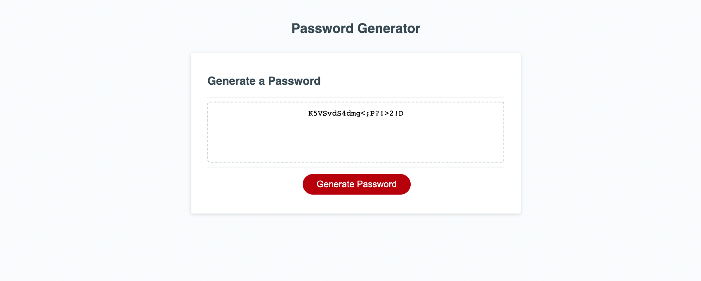

# password-generator
As an employee with access to sensitive data;
I want to randomly generate a password that meets certain criteria;
So that I can create a strong password that provides greater security. 

A simple set of prompts which give the user choice of critera to generate a password with lowercase or uppercase letters, special characters, and numbers.

Link : https://jaimemarsh.github.io/password-generator/